# Planning with Agents

**Multi-Agent Collaborative Task Planning and Execution**

Extends the `planning-with-files` pattern with automatic task decomposition, parallel sub-agent execution, and intelligent dependency management. When tasks are too complex for a single agent or would benefit from parallelization, this skill orchestrates multiple specialized agents working collaboratively.

## Core Value Proposition

1. **Context Isolation**: Each sub-agent has its own workspace, avoiding context overload
2. **Parallel Execution**: Independent tasks run concurrently, reducing wall-clock time
3. **Intelligent Decomposition**: Automatic or AI-assisted task breakdown
4. **Dependency Management**: DAG-based scheduling ensures correct execution order
5. **Smart Error Recovery**: Debug agents automatically diagnose and suggest fixes

## When to Use This Skill

### ✅ Use planning-with-agents when:

- **Complex multi-component projects** (e.g., full-stack applications, microservices)
- **Tasks with clear parallelizable sub-tasks** (e.g., frontend + backend simultaneously)
- **Large projects that would exceed context limits** (>50K tokens in single conversation)
- **Tasks requiring specialized expertise** in different domains (backend + frontend + DevOps)
- **User explicitly requests** task decomposition or parallel execution
- **Explicit markers present**: `#use-subagent`, `#delegate`, `#parallel`

### ❌ Don't use when:

- Simple, single-component tasks
- Sequential work with tight coupling (no parallelization benefit)
- Quick prototypes or experiments
- User wants single-agent interaction
- Estimated duration < 30 minutes

## Configuration

This skill reads from `config.json` in the skill directory. See the full configuration reference below.

**Key settings**:
- `sub_agents.enabled`: Enable/disable sub-agent creation
- `execution.scheduling.mode`: "sequential", "dag", or "parallel"
- `resource_limits.max_concurrent_agents`: How many agents can run simultaneously
- `observability.*`: Control logging, metrics, and visualization

## Core Workflow

### Phase 0: Master Planning (Same as planning-with-files)

1. **Create `.memory/task_plan.md`** with overall goal and high-level phases
2. **Research and document** in `.memory/notes.md`
3. **Decide**: Should this task use sub-agents?

### Phase 1: Sub-Agent Activation Decision

The skill decides whether to activate sub-agents based on:

#### 1. Explicit Markers (Highest Priority)
If task description contains any marker from config:
- `#use-subagent`, `#delegate`, `#分解任务`, `#parallel`
- **Action**: Immediately activate sub-agents

#### 2. Semantic Matching
Match against configured keywords and patterns:
```javascript
Keywords: ["microservices", "full-stack", "distributed system", ...]
Patterns: ["build.*application", "design.*system", ...]
```

#### 3. Agent Type Triggers
Based on the current agent type and task properties:
```json
{
  "agent_type": "backend-architect",
  "condition": "phase_count > 3"
}
```

#### 4. Complexity Threshold
Automatic detection based on:
- Phase count > `max_phases` (default: 5)
- Estimated hours > `estimated_hours` (default: 2)
- File count > `file_count` (default: 10)
- Description length > `description_tokens` (default: 500)

#### 5. AI Fallback
If rules don't match, use AI judgment:
- Analyze task description
- Consider: complexity, tech stacks, parallelization potential
- Decide: yes/no + rationale

**Decision Recording**:
Log the decision and rationale in `task_plan.md`:
```markdown
## Sub-Agent Decision
**Decision**: Activate sub-agents ✓
**Trigger**: Complexity threshold (phase_count=7 > max_phases=5)
**Rationale**: Task involves 7 distinct phases across 3 technology stacks (backend, frontend, database). Parallel execution of independent components can save ~40% time.
```

### Phase 2: Task Decomposition

If sub-agents are activated:

#### 1. Identify Sub-Tasks

Analyze the overall task and break it down into:
- **Independent tasks**: Can run in parallel (e.g., frontend + backend)
- **Dependent tasks**: Must wait for others (e.g., tests wait for implementation)
- **Sequential tasks**: Must run in specific order

**Document in `task_plan.md`**:
```markdown
## Sub-Task Breakdown
1. **API Schema Design** [Level 0] - Foundation
2. **Backend Implementation** [Level 1] - Depends on (1)
3. **Frontend Implementation** [Level 1] - Depends on (1)
4. **Integration Tests** [Level 2] - Depends on (2), (3)
```

#### 2. Create Dependencies Graph

Create `.memory/dependencies.yaml`:

```yaml
version: "1.0"
generated_at: "2026-01-06T19:00:00Z"

dependencies:
  - agent_id: a3b2c1
    task: "Design API schema"
    depends_on: []
    priority: high
    estimated_duration_minutes: 30

  - agent_id: 4f8e2d
    task: "Implement backend API"
    depends_on: [a3b2c1]
    priority: high
    estimated_duration_minutes: 120

  - agent_id: 2b3e5d
    task: "Build frontend UI"
    depends_on: [a3b2c1]
    priority: medium
    estimated_duration_minutes: 90

  - agent_id: 6a8c4f
    task: "Write integration tests"
    depends_on: [4f8e2d, 2b3e5d]
    priority: medium
    estimated_duration_minutes: 45
```

**Important**:
- Use descriptive task names
- Clearly specify all dependencies
- Assign realistic priorities and time estimates
- Ensure no circular dependencies (will be validated)

#### 3. Validate Dependencies

Run dependency validation:
```python
# Pseudo-code for validation
def validate_dependencies(deps_yaml):
    # 1. Check all agent_ids are unique
    # 2. Check all depends_on references exist
    # 3. Detect circular dependencies using DFS
    # 4. Generate execution plan using topological sort

    if has_cycles:
        raise ValueError("Circular dependency detected: A -> B -> C -> A")

    return execution_plan
```

**Update dependencies.yaml** with execution plan:
```yaml
execution_plan:
  levels:
    - level: 0
      agents: [a3b2c1]
      parallelizable: false
    - level: 1
      agents: [4f8e2d, 2b3e5d]  # Can run in parallel
      parallelizable: true
    - level: 2
      agents: [6a8c4f]
      parallelizable: false
```

### Phase 3: Sub-Agent Workspace Setup

For each sub-agent to be created:

#### 1. Generate Agent ID

Use configured naming scheme (default: hash-based):
```python
import hashlib
from datetime import datetime

def generate_agent_id(task_description, parent_id="master"):
    timestamp = datetime.utcnow().isoformat()
    input_str = f"{timestamp}_{task_description}_{parent_id}"
    hash_digest = hashlib.sha256(input_str.encode()).hexdigest()
    return hash_digest[:6]  # e.g., "a3b2c1"

agent_id = generate_agent_id("Design API schema")
# Result: "a3b2c1"
```

#### 2. Create Agent Directory

```
.memory/
└── agent-{agent_id}/
    ├── .agent_status.yaml    # Status tracking
    ├── context.yaml          # Context from master
    ├── task_plan.md          # Agent's plan
    ├── notes.md              # Agent's notes
    └── deliverable.md        # Agent's output
```

#### 3. Initialize Status File

Create `.memory/agent-{id}/.agent_status.yaml` (use template):
```yaml
agent_id: a3b2c1
task_description: "Design API schema and endpoints"
status: pending
parent_agent: master
depth: 1
created_at: "2026-01-06T19:00:15Z"
updated_at: "2026-01-06T19:00:15Z"

# ... rest of fields from template
```

#### 4. Prepare Context

Create `.memory/agent-{id}/context.yaml` with:

```yaml
global_context:
  project_goal: "Build a blog REST API"
  constraints:
    - "Use TypeScript"
    - "Must include authentication"
    - "Follow REST best practices"

parent_decisions:
  - decision: "Use JWT for auth"
    rationale: "Stateless, scalable"
    timestamp: "2026-01-06T18:45:00Z"

sibling_results: []  # Empty initially, updated as siblings complete

research_notes: |
  Key findings from master's research:
  - Popular blog APIs use /posts, /comments patterns
  - Authentication: Bearer token in Authorization header
  - Rate limiting: 100 req/min per user
```

**Context size management**:
- Limit to `max_context_size_tokens` (default: 10,000)
- If exceeds limit, auto-summarize to `summary_target_tokens` (default: 5,000)
- Include only essential information for this specific sub-task

#### 5. Update Registry

Add to Master's `task_plan.md`:
```markdown
## Sub Agents Registry
| Agent ID | Task | Status | Created | Path |
|----------|------|--------|---------|------|
| a3b2c1 | Design API schema | pending | 2026-01-06 19:00 | `.memory/agent-a3b2c1/` |
```

### Phase 4: Sub-Agent Execution

#### 1. DAG Scheduling

Execute agents level by level based on topological sort:

```python
# Pseudo-code for scheduler
async def execute_dag(execution_plan, config):
    for level in execution_plan.levels:
        if level.parallelizable and len(level.agents) > 1:
            # Parallel execution
            tasks = []
            for agent_id in level.agents[:config.max_concurrent_agents]:
                task = launch_sub_agent(agent_id)
                tasks.append(task)

            # Wait for all in this batch
            results = await asyncio.gather(*tasks)

            # Check for failures
            for result in results:
                if result.status == "failed":
                    handle_failure(result.agent_id)
        else:
            # Sequential execution
            for agent_id in level.agents:
                result = await launch_sub_agent(agent_id)
                if result.status == "failed":
                    handle_failure(result.agent_id)
```

#### 2. Launching a Sub-Agent

Use the **Task tool** with appropriate subagent_type:

```python
# Pseudo-invocation
Task(
    subagent_type="backend-architect",  # or appropriate type
    description=f"Execute sub-task: {task_description}",
    prompt=f\"\"\"
    You are a sub-agent working on: {task_description}

    **Your workspace**: `.memory/agent-{agent_id}/`

    **Context**: Read `.memory/agent-{agent_id}/context.yaml` for:
    - Project goals and constraints
    - Parent's decisions and rationale
    - Sibling agents' results (if available)

    **Your responsibilities**:
    1. Create `task_plan.md` in your workspace
    2. Execute your specific task
    3. Document findings in `notes.md`
    4. Create `deliverable.md` with final output
    5. Update `.agent_status.yaml` with:
       - status: "in-progress" when starting
       - status: "completed" when done
       - summary, artifacts, metadata

    **Important**:
    - Focus ONLY on your assigned task
    - Don't modify files outside your workspace
    - Update status file at each major step
    - Log any errors in status file

    Begin execution now.
    \"\"\"
)
```

#### 3. Monitoring Sub-Agent Progress

Poll status files at configured interval (default: 5 seconds):

```python
def monitor_agent(agent_id):
    status_file = f".memory/agent-{agent_id}/.agent_status.yaml"

    while True:
        status = read_yaml(status_file)

        if status.status == "completed":
            return status
        elif status.status == "failed":
            return trigger_debug_agent(agent_id, status)
        elif timeout_exceeded(status, config.single_agent_timeout_minutes):
            return mark_as_failed(agent_id, "Timeout exceeded")

        sleep(config.poll_interval_seconds)
```

#### 4. Handling Dependencies

Before launching an agent, ensure all dependencies are satisfied:

```python
def can_launch_agent(agent_id, dependencies, statuses):
    agent_deps = dependencies[agent_id].depends_on

    for dep_id in agent_deps:
        dep_status = statuses[dep_id]
        if dep_status.status != "completed":
            return False  # Dependency not ready

    return True  # All dependencies satisfied
```

### Phase 5: Error Handling and Debug Agents

When a sub-agent fails:

#### 1. Detect Failure

Status file shows:
```yaml
agent_id: 4f8e2d
status: failed
errors:
  - error_type: "ImportError"
    message: "Module 'jsonwebtoken' not found"
    timestamp: "2026-01-06T19:45:12Z"
```

#### 2. Launch Debug Agent

Create debug agent: `agent-{original_id}-debug`

```python
Task(
    subagent_type="debugging-toolkit:debugger",
    description=f"Debug failed agent {agent_id}",
    prompt=f\"\"\"
    Agent {agent_id} has failed. Your task is to diagnose and suggest fixes.

    **Failed agent's workspace**: `.memory/agent-{agent_id}/`

    **Available information**:
    1. Status file: `.memory/agent-{agent_id}/.agent_status.yaml`
    2. Task plan: `.memory/agent-{agent_id}/task_plan.md`
    3. Notes: `.memory/agent-{agent_id}/notes.md`
    4. Error details: See status.errors array

    **Your responsibilities**:
    1. Read all available context
    2. Analyze the error
    3. Identify root cause
    4. Suggest specific fixes
    5. Update `.memory/agent-{agent_id}-debug/.agent_status.yaml` with:
       - diagnosis.error_type
       - diagnosis.root_cause
       - recommendations (list of actions)
       - retry_suggested (true/false)

    **Limitations**:
    - You CANNOT create sub-agents (防止递归)
    - Max timeout: {config.debug_agent_timeout_minutes} minutes
    - If you can't diagnose, report why

    Analyze the failure and provide recommendations.
    \"\"\"
)
```

#### 3. Process Debug Results

```yaml
# .memory/agent-4f8e2d-debug/.agent_status.yaml
diagnosis:
  error_type: "ImportError"
  root_cause: "Missing npm package 'jsonwebtoken'"
  affected_files:
    - "src/auth/jwt.ts:3"

recommendations:
  - action: "install_dependency"
    command: "npm install jsonwebtoken @types/jsonwebtoken"
    rationale: "Package required for JWT operations"
  - action: "retry"
    reason: "After installing dependency, implementation should succeed"

retry_suggested: true
```

#### 4. User Confirmation and Retry

Present to user:
```
⚠️ Agent 4f8e2d failed: ImportError: jsonwebtoken

Debug agent analysis:
- Root cause: Missing npm dependency
- Suggested fix: npm install jsonwebtoken @types/jsonwebtoken
- Retry recommended: Yes

Apply fix and retry? [Y/n]
```

If approved:
```python
# Apply fixes
run_command("npm install jsonwebtoken @types/jsonwebtoken")

# Reset agent status
reset_agent_status(agent_id, status="pending")

# Retry execution
await launch_sub_agent(agent_id)
```

### Phase 6: Result Aggregation

As sub-agents complete:

#### 1. Collect Results

Read each agent's deliverable:
```python
def collect_results(agent_ids):
    results = {}
    for agent_id in agent_ids:
        status = read_yaml(f".memory/agent-{agent_id}/.agent_status.yaml")

        results[agent_id] = {
            "task": status.task_description,
            "status": status.status,
            "summary": status.summary,
            "artifacts": status.artifacts,
            "execution_time": status.execution_time_seconds
        }

    return results
```

#### 2. Update Sibling Context

When an agent completes, update context for dependent agents:

```python
def update_sibling_contexts(completed_agent_id):
    # Find agents that depend on this one
    dependent_agents = find_dependents(completed_agent_id)

    for dep_agent_id in dependent_agents:
        context_file = f".memory/agent-{dep_agent_id}/context.yaml"
        context = read_yaml(context_file)

        # Add completed agent's results
        context.sibling_results.append({
            "agent_id": completed_agent_id,
            "task": get_agent_task(completed_agent_id),
            "status": "completed",
            "artifacts": get_agent_artifacts(completed_agent_id),
            "summary": get_agent_summary(completed_agent_id)
        })

        write_yaml(context_file, context)
```

#### 3. Update Master's Task Plan

Mark phases as completed:
```markdown
## Phases
- [x] Phase 1: API Schema Design (agent-a3b2c1) ✓ 30m
- [x] Phase 2: Backend Implementation (agent-4f8e2d) ✓ 2h 15m
- [x] Phase 3: Frontend Implementation (agent-2b3e5d) ✓ 1h 45m
- [x] Phase 4: Integration Tests (agent-6a8c4f) ✓ 50m
```

#### 4. Generate Master Deliverable

Synthesize sub-agent results into master deliverable:

`.memory/deliverable.md`:
```markdown
# Blog REST API - Complete Implementation

## Overview
Successfully built a complete REST API for blog management with authentication, CRUD operations, and comprehensive tests.

## Components Delivered

### 1. API Schema (agent-a3b2c1)
- **Deliverable**: `.memory/agent-a3b2c1/api-schema.yaml`
- **Summary**: Designed RESTful endpoints following OpenAPI 3.0
- **Key decisions**: JWT auth, resource-based routing, versioning strategy

### 2. Backend Implementation (agent-4f8e2d)
- **Deliverable**: `src/api/` directory
- **Summary**: Implemented all endpoints with Express + TypeScript
- **Tests**: 87% coverage
- **Note**: Initially failed due to missing jsonwebtoken, auto-resolved by debug agent

### 3. Frontend Implementation (agent-2b3e5d)
- **Deliverable**: `src/components/` directory
- **Summary**: React components with TypeScript, Material-UI
- **Tests**: 92% coverage

### 4. Integration Tests (agent-6a8c4f)
- **Deliverable**: `tests/integration/` directory
- **Summary**: End-to-end tests covering all user flows
- **Results**: All 24 tests passing

## Metrics
- **Total time**: 5h 20m (wall-clock) vs 7h estimated (sequential)
- **Time saved**: 24% through parallelization
- **Total cost**: $1.43
- **Agents used**: 4 (+ 1 debug agent)

## Files Created
[List of all files from all agents]

## Next Steps
[Recommendations for deployment, monitoring, etc.]
```

### Phase 7: Observability and Reporting

#### 1. Agent Tree View

Update `task_plan.md` with live status:

```markdown
## Agent Execution Tree

```
master [in-progress] - Blog REST API
├── agent-a3b2c1 [completed] - API Schema (30m) ✓
├── agent-4f8e2d [completed] - Backend (2h 15m) ✓
│   └── agent-4f8e2d-debug [completed] - Fix dependency (5m) ✓
├── agent-2b3e5d [in-progress] - Frontend (1h 45m / est 1h 30m) ⚙
└── agent-6a8c4f [pending] - Integration Tests ⏸
```
```

**Status indicators**:
- ✓ Completed
- ⚙ In Progress
- ⏸ Pending
- ✗ Failed
- 🔧 Debugging

#### 2. Mermaid Execution Graph

Generate at task start and completion:

```markdown
## Execution Flow

```mermaid
graph TB
    master[Master Agent<br/>Blog REST API<br/>✓ Completed]

    a1[agent-a3b2c1<br/>API Schema<br/>✓ 30m]
    a2[agent-4f8e2d<br/>Backend API<br/>✓ 2h 15m]
    a3[agent-2b3e5d<br/>Frontend<br/>✓ 1h 45m]
    a4[agent-6a8c4f<br/>Tests<br/>✓ 50m]

    master --> a1
    master --> a2
    master --> a3
    master --> a4

    a2 -.depends.-> a1
    a3 -.depends.-> a1
    a4 -.depends.-> a2
    a4 -.depends.-> a3

    style a1 fill:#90EE90
    style a2 fill:#90EE90
    style a3 fill:#90EE90
    style a4 fill:#90EE90
```


```

**Color coding**:
- Green (#90EE90): Completed
- Yellow (#FFD700): In Progress
- Gray (#D3D3D3): Pending
- Red (#FF6B6B): Failed

#### 3. Performance Metrics

Generate at task completion:

```markdown
## Performance Report

### Execution Summary
- **Total Duration**: 5h 20m (wall-clock)
- **Sequential Estimate**: 7h 0m
- **Time Saved**: 24% (1h 40m)
- **Parallel Efficiency**: Good (frontend + backend ran simultaneously)

### Agent Breakdown
| Agent ID | Task | Duration | Tokens | Cost | Status |
|----------|------|----------|--------|------|--------|
| a3b2c1 | API Schema | 30m | 4,200 | $0.18 | ✓ |
| 4f8e2d | Backend | 2h 15m | 12,800 | $0.52 | ✓ |
| 2b3e5d | Frontend | 1h 45m | 9,600 | $0.41 | ✓ |
| 6a8c4f | Tests | 50m | 6,400 | $0.27 | ✓ |
| 4f8e2d-debug | Debug | 5m | 1,200 | $0.05 | ✓ |

**Totals**: 5h 20m, 34,200 tokens, $1.43

### Resource Usage
- **Peak Concurrent Agents**: 2 (frontend + backend)
- **Max Depth**: 1 (no recursive sub-agents)
- **Disk Usage**: 3.2 MB
- **Files Created**: 47
- **Tests Written**: 35 (all passing)

### Cost Analysis
- **Average cost per agent**: $0.36
- **Cost per hour**: $0.27
- **Under budget**: Yes ($1.43 / $5.00 = 29%)
```

#### 4. Unified Execution Log

`.memory/execution.log`:
```
2026-01-06 19:00:00 [INFO] [master] Master agent started: Blog REST API
2026-01-06 19:00:05 [INFO] [master] Sub-agent decision: ACTIVATE (complexity threshold)
2026-01-06 19:00:10 [INFO] [master] Created dependencies.yaml with 4 agents
2026-01-06 19:00:15 [INFO] [master] Triggering agent a3b2c1: API Schema
2026-01-06 19:00:15 [INFO] [a3b2c1] Agent started
2026-01-06 19:30:30 [INFO] [a3b2c1] Agent completed successfully
2026-01-06 19:30:35 [INFO] [master] Dependencies met for agents: 4f8e2d, 2b3e5d
2026-01-06 19:30:35 [INFO] [master] Launching parallel: 4f8e2d, 2b3e5d
2026-01-06 19:30:35 [INFO] [4f8e2d] Agent started
2026-01-06 19:30:35 [INFO] [2b3e5d] Agent started
2026-01-06 20:45:12 [ERROR] [4f8e2d] Agent failed: ImportError: jsonwebtoken
2026-01-06 20:45:15 [INFO] [master] Triggering debug agent: 4f8e2d-debug
2026-01-06 20:45:15 [INFO] [4f8e2d-debug] Debug agent started
2026-01-06 20:50:22 [INFO] [4f8e2d-debug] Diagnosis complete: Missing dependency
2026-01-06 20:50:30 [INFO] [master] Applying fix: npm install jsonwebtoken
2026-01-06 20:51:00 [INFO] [master] Retrying agent 4f8e2d
2026-01-06 20:51:00 [INFO] [4f8e2d] Agent restarted
2026-01-06 22:15:45 [INFO] [2b3e5d] Agent completed successfully
2026-01-06 23:06:15 [INFO] [4f8e2d] Agent completed successfully
2026-01-06 23:06:20 [INFO] [master] Dependencies met for agent: 6a8c4f
2026-01-06 23:06:20 [INFO] [6a8c4f] Agent started
2026-01-06 23:56:30 [INFO] [6a8c4f] Agent completed successfully
2026-01-06 23:56:35 [INFO] [master] All agents completed successfully
2026-01-06 23:56:40 [INFO] [master] Generating master deliverable
2026-01-06 00:20:00 [INFO] [master] Master agent completed
```

### Phase 8: Resource Management

Throughout execution, enforce resource limits:

#### 1. Agent Count Limits

```python
def can_create_agent(current_count, config):
    if current_count >= config.resource_limits.max_total_agents:
        log_warning(f"Max agents ({config.max_total_agents}) reached")
        return False
    return True
```

#### 2. Depth Limits

```python
def can_create_subagent(current_depth, config):
    if current_depth >= config.resource_limits.max_depth:
        log_warning(f"Max depth ({config.max_depth}) reached")
        return False
    return True
```

#### 3. Timeout Enforcement

```python
async def execute_with_timeout(agent_id, timeout_minutes):
    try:
        async with asyncio.timeout(timeout_minutes * 60):
            result = await launch_sub_agent(agent_id)
            return result
    except asyncio.TimeoutError:
        mark_agent_failed(agent_id, "Execution timeout")
        return None
```

#### 4. Cost Tracking

```python
def estimate_cost(context_tokens, config):
    # Estimate input/output tokens
    estimated_input = context_tokens + 5000  # Base prompt
    estimated_output = 10000  # Average output

    cost = (
        estimated_input / 1000 * config.token_price_per_1k.input +
        estimated_output / 1000 * config.token_price_per_1k.output
    )

    return cost

def check_cost_limits(total_cost, config):
    if total_cost >= config.cost_controls.hard_limit_usd:
        raise CostLimitExceeded("Hard limit reached")
    elif total_cost >= config.cost_controls.warning_threshold_usd:
        warn_user(f"Cost warning: ${total_cost:.2f} / ${config.hard_limit_usd}")
```

#### 5. Disk Quota

```python
def check_disk_usage(memory_dir, config):
    total_size_mb = get_directory_size(memory_dir) / (1024 * 1024)

    if total_size_mb >= config.resource_limits.disk_quota_mb:
        log_warning(f"Disk quota ({config.disk_quota_mb}MB) exceeded: {total_size_mb:.1f}MB")
        # Optionally: archive old agents, compress files, etc.
```

## Critical Rules

### 1. Status File Protocol

**Sub-agents MUST**:
- Update `.agent_status.yaml` when starting (status: "in-progress")
- Update when completing (status: "completed", summary, artifacts)
- Update on errors (status: "failed", errors array)
- Use ISO 8601 timestamps
- Include all required metadata

### 2. Workspace Isolation

**Each agent**:
- ONLY writes to its own directory (`.memory/agent-{id}/`)
- NEVER modifies sibling or parent files
- Reads context from `context.yaml`
- Outputs results to its own `deliverable.md`

### 3. Dependency Integrity

**Dependencies.yaml**:
- All `agent_id` values must be unique
- All `depends_on` references must exist
- No circular dependencies (validated before execution)
- Updated atomically (no partial writes)

### 4. Debug Agent Constraints

**Debug agents**:
- CANNOT create sub-agents (depth limit enforced)
- Have shorter timeout (default: 10 minutes)
- Must provide `retry_suggested` boolean
- If debug fails, fall back to simple retry or manual intervention

### 5. Master Responsibilities

**Master agent MUST**:
- Create and maintain `dependencies.yaml`
- Monitor all sub-agent statuses
- Update agent tree view in `task_plan.md`
- Aggregate results into master `deliverable.md`
- Enforce resource limits
- Handle failures gracefully

## Advanced Patterns

### Recursive Sub-Agents

Sub-agents can themselves activate sub-agents (up to `max_depth`):

```
master (depth 0)
└── agent-user (depth 1) - User service
    ├── agent-user-a1 (depth 2) - DB schema
    ├── agent-user-a2 (depth 2) - Auth API
    └── agent-user-a3 (depth 2) - Profile API
```

**When a Level 1 agent wants to create Level 2 agents**:
1. Create its own `dependencies.yaml` in its workspace
2. Use planning-with-agents recursively
3. Results bubble up through status files

### Dynamic Dependency Updates

If a sub-agent discovers new tasks mid-execution:

```python
# In sub-agent
def discover_new_task():
    # Update master's dependencies.yaml
    deps = read_yaml(".memory/dependencies.yaml")

    new_agent = {
        "agent_id": generate_agent_id("New discovered task"),
        "task": "Handle edge case X",
        "depends_on": [current_agent_id],
        "priority": "medium"
    }

    deps.dependencies.append(new_agent)
    write_yaml(".memory/dependencies.yaml", deps)

    # Re-validate and update execution plan
    validate_and_plan(deps)
```

### Conditional Execution

Some agents may be conditionally activated:

```yaml
dependencies:
  - agent_id: opt-perf
    task: "Performance optimization"
    depends_on: [impl-backend]
    priority: low
    condition: "if backend response time > 200ms"
```

The master checks conditions before launching.

## Best Practices

### 1. Task Granularity

- **Too coarse**: "Build entire application" (loses parallelization benefit)
- **Too fine**: "Write one function" (overhead exceeds benefit)
- **Just right**: "Implement authentication service" (2-4 hours, clear scope)

### 2. Dependency Minimization

- Minimize dependencies to maximize parallelization
- Use shared artifacts (e.g., API schema) as handoff points
- Document interfaces clearly for dependent agents

### 3. Context Optimization

- Only include essential context for each sub-agent
- Summarize parent's research notes (don't copy entire notes.md)
- Use artifact paths instead of embedding large content

### 4. Error Resilience

- Set realistic timeouts
- Use debug agents for diagnosable errors
- Have fallback strategies (manual intervention)
- Log all decisions and errors

### 5. Cost Efficiency

- Set appropriate warning thresholds
- Monitor token usage per agent
- Use cheaper models for simple sub-tasks (configure via Task tool model parameter)
- Archive completed agents to free disk space

## Troubleshooting

### Issue: Circular Dependency Detected

**Error**: "Circular dependency: A -> B -> C -> A"

**Solution**:
1. Review `dependencies.yaml`
2. Identify the cycle
3. Break the cycle by removing or reordering dependencies
4. Consider if tasks can be merged

### Issue: Agent Stuck in "in-progress"

**Possible causes**:
- Agent crashed without updating status
- Infinite loop in agent code
- Network/system issue

**Solution**:
1. Check execution log for last activity
2. If timeout not reached, wait longer
3. If timeout exceeded, mark as failed manually
4. Investigate agent's workspace for clues

### Issue: Debug Agent Can't Diagnose

**Debug agent reports**: "Unable to determine root cause"

**Solution**:
1. Manual inspection of agent workspace
2. Check for system-level issues (permissions, disk space)
3. Review agent's task plan and notes
4. Consider retrying without debug (simple retry)

### Issue: Cost Exceeds Budget

**Warning**: "Cost $5.20 exceeds warning threshold $5.00"

**Solution**:
1. Review which agents used most tokens
2. Consider if some sub-tasks can be simplified
3. Adjust `max_concurrent_agents` to reduce parallel load
4. Increase cost limits if justified

## Configuration Reference

See `config.json` for full configuration schema. Key sections:

### storage
- `baseDirectory`: Where to create .memory/ (default: ".memory")
- `autoCreateDirectory`: Auto-create if missing (default: true)

### sub_agents
- `enabled`: Enable/disable sub-agent creation
- `triggers.*`: Rules for automatic activation
- `naming.scheme`: "hash", "timestamp", or "sequential"

### execution
- `scheduling.mode`: "sequential", "dag", or "parallel"
- `scheduling.max_concurrent_agents`: Parallelism limit (default: 3)
- `failure_handling.strategy`: "fail_fast", "continue", "debug_agent", "retry"

### resource_limits
- `max_total_agents`: Total agent limit (default: 20)
- `max_depth`: Nesting depth limit (default: 5)
- `cost_controls.*`: Cost tracking and limits

### observability
- `agent_tree_view.enabled`: Show agent tree in task_plan.md
- `execution_log.enabled`: Create unified execution.log
- `mermaid_diagrams.enabled`: Generate Mermaid graphs
- `performance_metrics.enabled`: Track and report metrics

## Examples

See the `examples/` directory:
- `simple-example.md`: REST API with 4 sub-agents
- `complex-example.md`: E-commerce platform with 3-level hierarchy

## Comparison with planning-with-files

| Feature | planning-with-files | planning-with-agents |
|---------|---------------------|----------------------|
| **Scope** | Single-agent tasks | Multi-agent collaboration |
| **Context** | Single context | Isolated contexts per agent |
| **Execution** | Sequential | Parallel (DAG-based) |
| **Complexity** | Simple to medium | Medium to very complex |
| **Files** | 3 files in .memory/ | 3 files + agent subdirs |
| **Overhead** | Low | Medium (coordination cost) |
| **Best for** | Individual tasks, research | Complex projects, parallel work |

**When to upgrade**: Use planning-with-agents when planning-with-files hits:
- Context limits (>50K tokens)
- Clear parallelization opportunities
- Multi-domain expertise needs
- Explicit user request for decomposition

---

## Quick Reference

### Activation Decision Flow

```
Task received
    ↓
Explicit marker? → YES → Activate sub-agents
    ↓ NO
Semantic match? → YES → Activate sub-agents
    ↓ NO
Agent type trigger? → YES → Activate sub-agents
    ↓ NO
Complexity threshold? → YES → Activate sub-agents
    ↓ NO
AI judgment → Activate? → YES/NO
```

### File Structure

```
.memory/
├── task_plan.md              # Master plan
├── notes.md                  # Master notes
├── deliverable.md            # Final output
├── dependencies.yaml         # DAG graph
├── execution.log             # Unified log
├── agent-{id}/               # Sub-agent workspace
│   ├── .agent_status.yaml    # Status tracking
│   ├── context.yaml          # Context from master
│   ├── task_plan.md          # Agent's plan
│   ├── notes.md              # Agent's notes
│   └── deliverable.md        # Agent's output
└── agent-{id}-debug/         # Debug agent (if needed)
    └── .agent_status.yaml
```

### Status Values

- `pending`: Created, not started
- `in-progress`: Currently executing
- `completed`: Successfully finished
- `failed`: Encountered error
- `blocked`: Waiting for dependencies

---

**Version**: 1.0.0
**Last Updated**: 2026-01-06
**Requires**: Claude Code 1.0.0+
**License**: MIT
