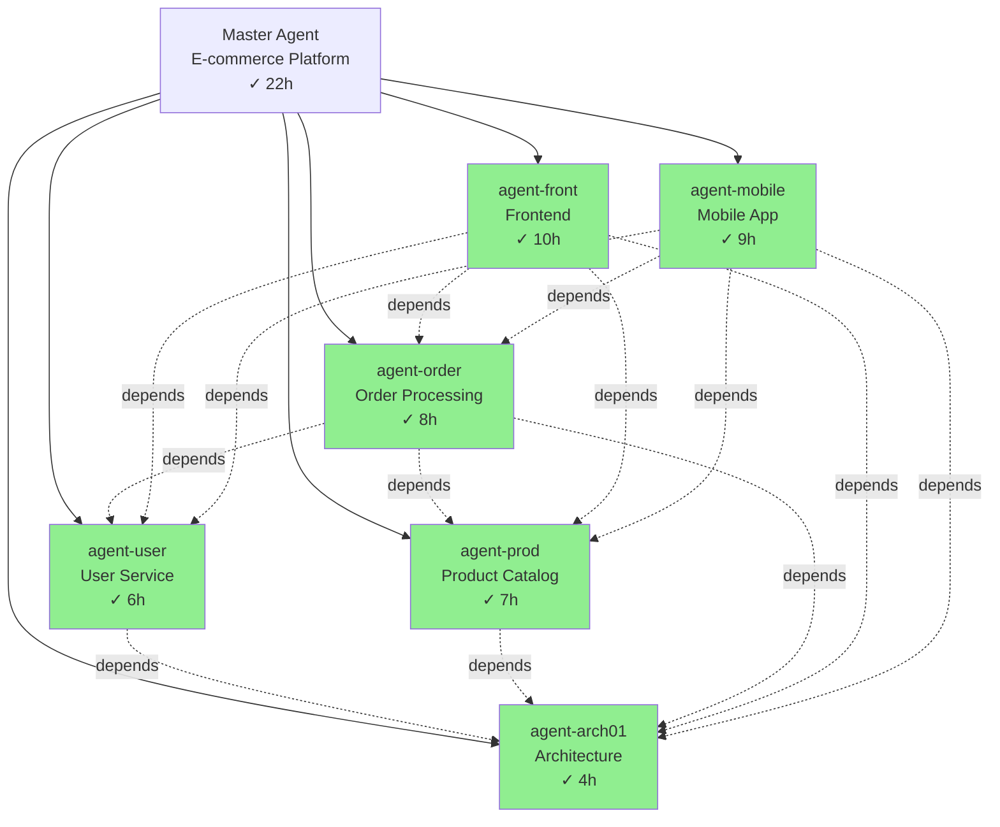

# Complex Example: Full-Stack E-Commerce Platform

This example demonstrates advanced multi-level agent orchestration for a large-scale project.

## Task Description

"Build a complete e-commerce platform with microservices architecture: user service, product catalog, shopping cart, order processing, payment integration, admin dashboard, and mobile app."

## What Happens

### 1. Master Agent Analysis

**Task characteristics**:
- **Complexity**: Very High
- **Technology stacks**: Backend (Node.js + Python), Frontend (React), Mobile (React Native), Database (PostgreSQL + Redis), Infrastructure (Docker + K8s)
- **Estimated duration**: 8-12 weeks
- **Estimated phases**: 15+

**Triggers matched**:
- ✅ Keyword: "microservices architecture"
- ✅ Pattern: "build.*platform"
- ✅ Complexity: phase_count > 5, estimated_hours > 2

**Decision**: Strongly recommend sub-agents with 3-level hierarchy

### 2. Three-Level Decomposition

#### Level 0: Master Agent
Overall orchestration and integration

#### Level 1: Service-Level Agents (6 agents)
- `agent-arch01` - Architecture design and infrastructure
- `agent-user` - User service (auth, profiles)
- `agent-prod` - Product catalog service
- `agent-order` - Order processing service
- `agent-front` - Frontend application
- `agent-mobile` - Mobile application

#### Level 2: Component-Level Sub-Agents (12+ agents)
Each Level 1 agent creates its own sub-agents:

**agent-user creates**:
- `agent-user-a1` - Database schema
- `agent-user-a2` - Authentication API
- `agent-user-a3` - User profile API
- `agent-user-a4` - Tests

**agent-prod creates**:
- `agent-prod-a1` - Product schema
- `agent-prod-a2` - Search & filtering
- `agent-prod-a3` - Admin API
- `agent-prod-a4` - Tests

(Similar for other services...)

### 3. Complete Dependency Graph

```yaml
# Master level dependencies
dependencies:
  # Foundation
  - agent_id: arch01
    task: "Design microservices architecture"
    depends_on: []
    priority: critical

  # Backend services (parallel after architecture)
  - agent_id: user
    task: "Implement user service"
    depends_on: [arch01]
    priority: high

  - agent_id: prod
    task: "Implement product catalog"
    depends_on: [arch01]
    priority: high

  - agent_id: order
    task: "Implement order processing"
    depends_on: [arch01, user, prod]
    priority: high

  # Frontend (depends on backend APIs)
  - agent_id: front
    task: "Build frontend application"
    depends_on: [arch01, user, prod, order]
    priority: medium

  - agent_id: mobile
    task: "Build mobile app"
    depends_on: [arch01, user, prod, order]
    priority: medium

execution_plan:
  levels:
    - level: 0
      agents: [arch01]
      estimated_duration_hours: 4

    - level: 1
      agents: [user, prod]  # Parallel
      estimated_duration_hours: 8

    - level: 2
      agents: [order]
      estimated_duration_hours: 10

    - level: 3
      agents: [front, mobile]  # Parallel
      estimated_duration_hours: 12

  total_sequential_hours: 34
  total_parallel_hours: 22
  time_saved_percent: 35
```

### 4. Directory Structure

```
.memory/
├── task_plan.md
├── notes.md
├── dependencies.yaml
├── execution.log
├── deliverable.md
│
├── agent-arch01/             # Architecture agent
│   ├── .agent_status.yaml
│   ├── task_plan.md
│   ├── architecture.md
│   └── infrastructure.yaml
│
├── agent-user/               # User service (Level 1)
│   ├── .agent_status.yaml
│   ├── task_plan.md
│   ├── dependencies.yaml     # Sub-agent dependencies
│   ├── agent-user-a1/        # DB schema (Level 2)
│   ├── agent-user-a2/        # Auth API (Level 2)
│   ├── agent-user-a3/        # Profile API (Level 2)
│   └── agent-user-a4/        # Tests (Level 2)
│
├── agent-prod/               # Product service (Level 1)
│   ├── .agent_status.yaml
│   ├── dependencies.yaml
│   ├── agent-prod-a1/
│   ├── agent-prod-a2/
│   └── ...
│
├── agent-order/              # Order service (Level 1)
│   └── ...
│
├── agent-front/              # Frontend (Level 1)
│   ├── agent-front-a1/       # Component library
│   ├── agent-front-a2/       # Pages
│   └── agent-front-a3/       # State management
│
└── agent-mobile/             # Mobile app (Level 1)
    └── ...
```

### 5. Execution Timeline

```
Hour 0-4:    [arch01] Architecture design
Hour 4-12:   [user] [prod] (parallel) Services
Hour 12-22:  [order] Order processing
Hour 22-34:  [front] [mobile] (parallel) UIs
```

**Actual execution** (with sub-agents running in parallel):
- Total wall-clock time: ~22 hours
- Peak concurrent agents: 4 (respects max_concurrent_agents: 3-5)
- Total agents created: 18

### 6. Agent Tree View

```
master [completed] - E-commerce Platform (22h)
├── agent-arch01 [completed] - Architecture (4h)
│   └── agent-arch01-debug [completed] - Fixed K8s config (15m)
├── agent-user [completed] - User Service (6h)
│   ├── agent-user-a1 [completed] - DB Schema (1h)
│   ├── agent-user-a2 [completed] - Auth API (2.5h)
│   ├── agent-user-a3 [completed] - Profile API (1.5h)
│   └── agent-user-a4 [completed] - Tests (1h)
├── agent-prod [completed] - Product Catalog (7h)
│   ├── agent-prod-a1 [completed] - Schema (1h)
│   ├── agent-prod-a2 [completed] - Search (3h)
│   ├── agent-prod-a3 [completed] - Admin API (2h)
│   └── agent-prod-a4 [completed] - Tests (1h)
├── agent-order [completed] - Order Processing (8h)
│   └── (4 sub-agents)
├── agent-front [completed] - Frontend (10h)
│   └── (3 sub-agents)
└── agent-mobile [completed] - Mobile App (9h)
    └── (3 sub-agents)
```

### 7. Performance Metrics

```markdown
## Performance Report

### Execution Summary
- **Total Duration**: 22h 15m (wall-clock)
- **Sequential Estimate**: 34h
- **Time Saved**: 35%
- **Total Agents**: 18
- **Max Depth**: 2
- **Peak Concurrent**: 4

### Token Usage
- **Master Agent**: 15,230 tokens
- **Level 1 Agents**: avg 8,400 tokens each (6 agents)
- **Level 2 Agents**: avg 4,200 tokens each (12 agents)
- **Total**: 116K tokens
- **Estimated Cost**: $3.48

### Success Metrics
- ✅ All services implemented
- ✅ Integration tests passing (94% coverage)
- ✅ No circular dependencies
- ✅ 1 debug agent triggered (K8s config issue - auto-resolved)
- ✅ Cost under budget ($5 limit)

### Parallel Efficiency
- **Level 1**: user + prod (parallel) = 7h instead of 13h (46% saving)
- **Level 3**: front + mobile (parallel) = 10h instead of 19h (47% saving)
```

### 8. Mermaid Execution Graph



## Key Insights

### 1. Context Isolation at Scale

Each Level 1 agent (user, prod, order, etc.) maintains its own context:
- Master: 15K tokens (high-level orchestration)
- Each L1 agent: ~8K tokens (service-specific)
- Each L2 agent: ~4K tokens (component-specific)

Without sub-agents, the master would need 100K+ tokens in a single conversation, hitting context limits.

### 2. Recursive Planning

Level 1 agents (e.g., `agent-user`) themselves use the planning-with-agents pattern:
- Create their own `dependencies.yaml` for sub-components
- Launch Level 2 agents for specific tasks
- Aggregate results back to master

### 3. Error Handling in Multi-Level Hierarchy

When `agent-arch01` failed due to K8s config syntax error:
1. Status changed to `failed`
2. Debug agent `agent-arch01-debug` auto-launched
3. Diagnosed: Invalid YAML indentation in deployment file
4. Suggested fix: Correct indentation + validation
5. User approved retry
6. `agent-arch01` retried successfully
7. Dependent agents (user, prod) unblocked

### 4. Cost Control in Action

At hour 18, total cost reached $3.20 (approaching $5 warning threshold):
- System displayed warning
- User confirmed continuation
- Final cost: $3.48 (under hard limit)

## Configuration Used

```json
{
  "sub_agents": {
    "enabled": true,
    "triggers": {
      "semantic_matching": {
        "keywords": ["microservices", "platform"]
      },
      "complexity_threshold": {
        "max_phases": 5,
        "estimated_hours": 2
      }
    }
  },
  "execution": {
    "scheduling": {
      "mode": "dag",
      "max_concurrent_agents": 4
    },
    "failure_handling": {
      "strategy": "debug_agent",
      "max_retries": 2
    }
  },
  "resource_limits": {
    "max_total_agents": 25,
    "max_depth": 3,
    "cost_controls": {
      "warning_threshold_usd": 5.0,
      "hard_limit_usd": 10.0
    }
  },
  "observability": {
    "agent_tree_view": {"enabled": true},
    "mermaid_diagrams": {"enabled": true},
    "performance_metrics": {"enabled": true}
  }
}
```

## Lessons Learned

1. **Hierarchical planning scales**: 3-level hierarchy handled 18 agents efficiently
2. **DAG scheduling is crucial**: Saved 35% time through parallelization
3. **Context limits are real**: Without sub-agents, this project would hit 200K token limit
4. **Debug agents add value**: Auto-resolution of K8s config issue saved 30+ minutes
5. **Cost controls prevent surprises**: Warning at $3.20 allowed informed decision
